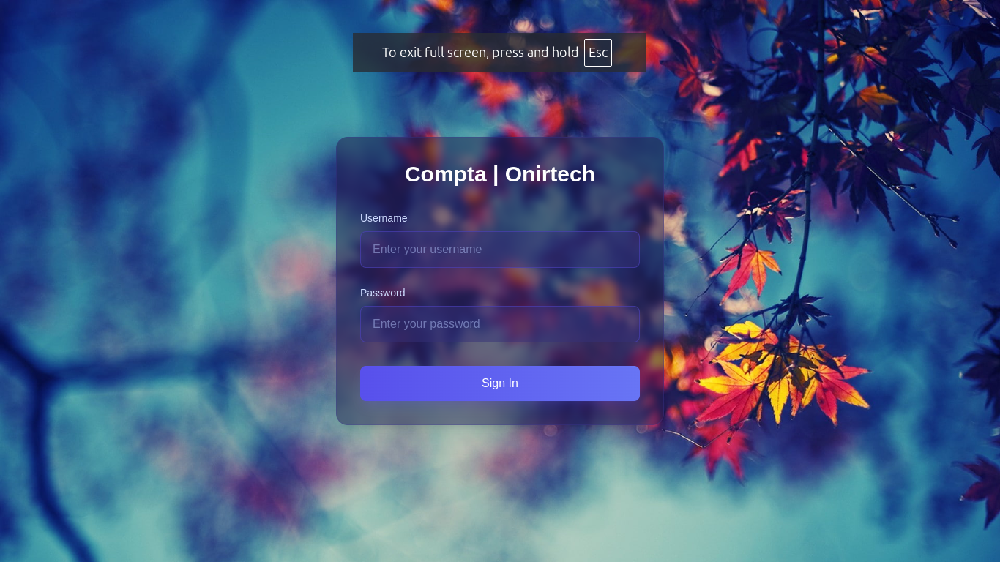

# React + TypeScript + Vite

## Get started

### Installing all dependencies
```bash
npm install
```

## Runnig app
```bash
npm run dev
```

## Outup:

```bash
➜  Local:   http://localhost:5173/
➜  Network: use --host to expose
➜  press h + enter to show help
```